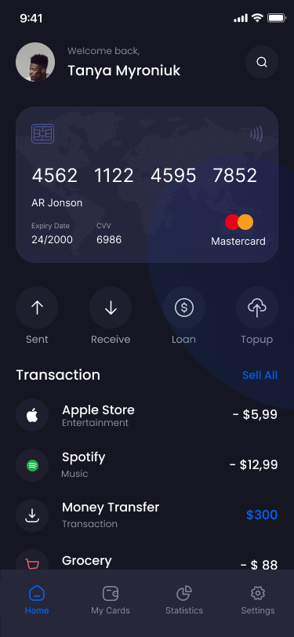
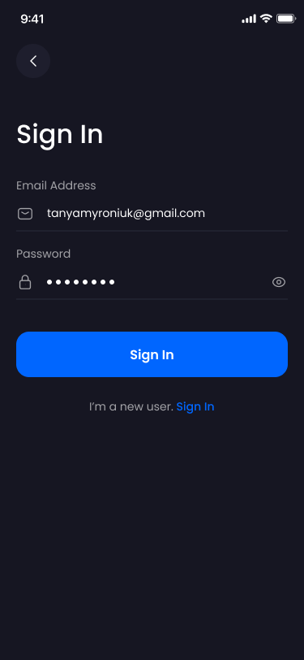
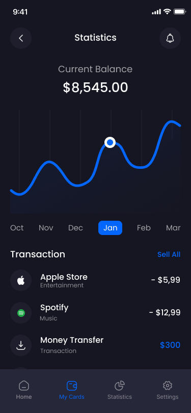
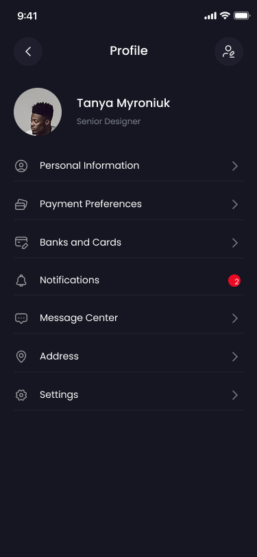

# My Banking Application

## Overview

<!--  -->
<div style="display:flex; padding-bottom:20px">
    
    
    
    
</div>

**My Banking** is a full-stack banking application designed to provide users with a seamless and secure banking experience.
The project has the intent to serve as a demonstration of a ficticious full-stack banking application. Ii includes a **server-side backend** for handling business logic and data storage, and a **client-side mobile application** for user interaction. The application supports features such as user authentication, transaction management, and real-time updates using Kafka.

UI designs credit: [Divus Motion ✨](https://divusmotion.com)

---

## Features

### Backend

-   **User Authentication**: Secure user registration, login, and session management using JWT.
-   **Transaction Management**: Deposit, withdrawal, and transfer functionalities with real-time Kafka-based processing.
-   **Database Integration**: PostgreSQL database with TypeORM for data persistence.
-   **Logging**: Winston-based logging for debugging and monitoring.
-   **API Endpoints**: RESTful APIs for authentication, transactions, and user management.

### Frontend

-   **React Native Mobile App**: Built with Expo for cross-platform support (iOS, Android, and Web).
-   **Redux Toolkit**: State management for authentication and transactions.
-   **Themed UI**: Light and dark mode support with reusable components.
-   **File-Based Routing**: Simplified navigation using Expo Router.
-   **Animations**: Smooth and interactive animations using `react-native-reanimated`.

---

## Architecture

### Backend

-   **Node.js**: Server runtime.
-   **Express**: Web framework for building REST APIs.
-   **TypeORM**: ORM for PostgreSQL database.
-   **Kafka**: Message broker for real-time transaction processing.
-   **Docker**: Containerized services for Kafka and PostgreSQL.

### Frontend

-   **React Native**: Cross-platform mobile app framework.
-   **Expo**: Development environment for React Native.
-   **Redux Toolkit**: State management and API integration.
-   **Secure Storage**: Token storage using `expo-secure-store`.

---

## Installation

### Prerequisites

-   **Node.js**: v18 or higher
-   **Docker**: For running Kafka and PostgreSQL
-   **Expo CLI**: For running the mobile app
-   **PostgreSQL**: Installed locally or via Docker

### Backend Setup

1. Navigate to the `server` directory:
    ```bash
    cd server
    ```
2. Install dependencies:
    ```bash
    npm install
    ```
3. Configure environment variables:

    Create a `.env` file in the `server` directory with the following:

    ```
    DB_HOST=localhost
    DB_PORT=5432
    DB_USER=your_db_user
    DB_PASSWORD=your_db_password
    DB_NAME=my_banking
    JWT_SECRET=your_jwt_secret
    KAFKA_BROKER=localhost:9092
    ```

4. Start Kafka and PostgreSQL using Docker:
    ```bash
    ./tools/setup_kafka.sh
    ./tools/setup_db.sh
    ```
5. Start the server:
    ```bash
    npm run dev
    ```

### Frontend Setup

1. Navigate to the `client` directory:
    ```bash
    cd client
    ```
2. Install dependencies:
    ```bash
    npm install
    ```
3. Start the Expo development server:
    ```bash
    npm start
    ```
4. Open the app:
    - Use the Expo Go app on your mobile device.
    - Or run the app on an emulator/simulator.

---

## Usage

### Backend: (WIP)

-   **API Endpoints**:
    -   `POST /api/auth/register`: Register a new user.
    -   `POST /api/auth/login`: Login and receive a JWT token.
    -   `GET /api/transactions/all`: Fetch all transactions for a user.
    -   `POST /api/transactions/deposit`: Deposit money.
    -   `POST /api/transactions/withdrawal`: Withdraw money.

### Frontend: (WIP)

-   **Sign In/Sign Up**: Authenticate users securely.
-   **Dashboard**: View account balance and recent transactions.
-   **Transactions**: Perform deposits and withdrawals.
-   **Settings**: Manage user preferences and logout.

---

## Project Structure

```
my-banking/
├── client/                # Frontend mobile app
│   ├── app/               # Screens and navigation
│   ├── components/        # Reusable UI components
│   ├── lib/               # State management and API integration
│   ├── assets/            # Static assets (images, fonts)
│   └── scripts/           # Utility scripts
├── server/                # Backend server
│   ├── config/            # Configuration files (database, Kafka)
│   ├── models/            # Database models
│   ├── routes/            # API routes
│   ├── services/          # Business logic
│   ├── utils/             # Utility functions (logger, JWT helper)
│   └── tools/             # Setup scripts for Kafka and PostgreSQL
└── shared/                # Shared TypeScript types
```

---

## Testing

### Backend

-   Run tests using Jest:
    ```bash
    npm test
    ```

### Frontend

-   Run tests using Jest:
    ```bash
    npm test
    ```

---

## License

This project is licensed under the MIT License. See the [LICENSE](LICENSE) file for details.

---

## Acknowledgments

-   [Expo](https://expo.dev)
-   [React Native](https://reactnative.dev)
-   [KafkaJS](https://kafka.js.org)
-   [TypeORM](https://typeorm.io)
-   [Winston](https://github.com/winstonjs/winston)
